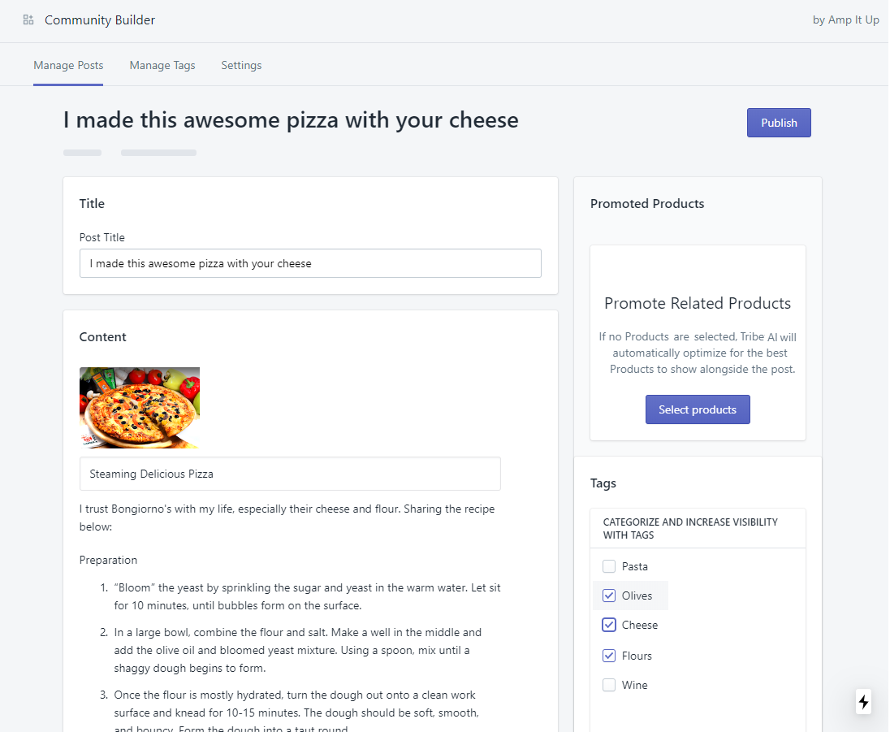
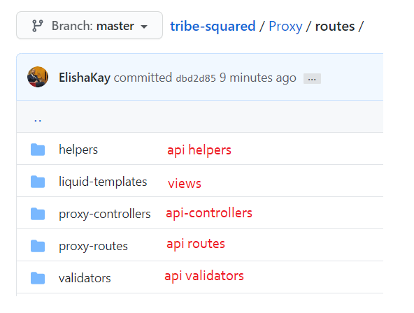
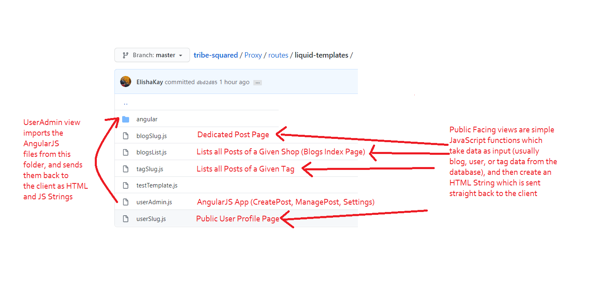
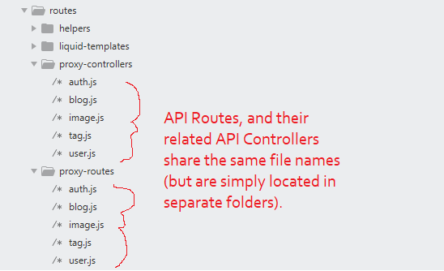

<h1>Tribe Social</h1>


Table of Contents for this Repo:

- [About](#about)
- [Technologies Overview](#technologies)
- [Getting Started](#getting-started)

<br>


About
--------

We empower shopify store owners to promote whatever products they like alongside user-generated content.

But, what if a store owner is too lazy to go through every single piece of new shopper content and set the right products to promote alongside it? After all, this app could help you generate thousands of new pages on your site. 

No time? No problem. Let our AI-powered Recommendation Algorithm to help you show the right products to the right shoppers.


Technologies
--------
```bash
  Admin Frontend: NextJS 
  Proxy: NodeJS (Routes, Controllers)
  Admin Backend: NodeJS (Routes, Controllers)
```

<br>


Getting Started
---------------

The easiest way to get started is to clone the repository:

```bash
# Get the latest snapshot
git clone https://github.com/ElishaKay/tribe-squared

# Running the Admin Backend
cd Admin-Backend
npm install
npm start

# Running the Admin Frontend
cd Admin-Frontend
npm install
npm run dev

# Running the Proxy Server
cd Proxy
npm install
npm start
```

<h2>Proxy App Structure</h2>




<h2>Proxy Views</h2>




<h2>Proxy Routes and Controllers</h2>



<br/>

Proxy API Routes <a href='https://github.com/ElishaKay/tribe-squared/tree/master/Proxy/routes/proxy-routes'>are defined here</a>.

The Proxy API Controller Functions are <a href='https://github.com/ElishaKay/tribe-squared/tree/master/Proxy/routes/proxy-controllers'>defined here</a>.

<h3>Importing Controller Functions into Route Files</h3>

Controller functions are imported and injected into the routes files like so (Example from <a href='https://github.com/ElishaKay/tribe-squared/blob/master/Proxy/routes/proxy-routes/blog.js'>Proxy/routes/proxy-routes/blog.js</a>:
):

```javascript
const {
    create,
    list,
    listForSitemap,
    listAllBlogsCategoriesTags,
    read,
    remove,
    listByUser
} = require('../proxy-controllers/blog');
```

<h3>When an HTTP Request Hits The Server</h3>

Here's another exampe from that same route file mentioned above, <a href='https://github.com/ElishaKay/tribe-squared/blob/master/Proxy/routes/proxy-routes/blog.js'>Proxy/routes/proxy-routes/blog.js</a>:

```javascript
router.post('/user/blog', requireSignin, authMiddleware, create);
```

That means, when a Post request is made to '/proxy/blog', the Req, Res, and Next objects are passed to the <em>requireSignin, adminMiddleware, and create</em> in sequential order.

<h3>The Req, Res, and Next() Conveyor belt</h3>

The <em>Req</em> object contains all the functionality required for handling a request.
The <em>Res</em> object contains all the functionality required for sending back a response.
The <em>Next</em> function contains all the functionality required for sending <em>Req & Res</em> into the next function in the Conveyor Belt.

The easiest way to think of these 3 objects is as if they are going through a Manufacturing Conveyor Belt. Each function (also called: 'middleware') has the ability to tack new fields unto these objects.

For example, <a href='https://github.com/ElishaKay/tribe-squared/blob/master/Proxy/routes/proxy-controllers/auth.js'>in the authMiddleware function</a>, we grab the email from the POST query string, search the database for that user, and then tack the user object unto the Req object, like so:

```javascript
exports.authMiddleware = (req, res, next) => {
    // grab the email from the POST query string
    let email = req.query.email.toLowerCase();
    ... 
    // search the database for the user with the given email
    User.findOne({ email: email }).exec((err, user) => {
    ...
    //tack the user object unto the Req object so that the user object can be accessed by the next middleware functions down the chain 
    req.user = user;
    ...
    // Pass the req, res, and next() objects into the next function in the chain
    next();
```

The benefit of this is that when we get to the next function in the chain, the <a href='https://github.com/ElishaKay/tribe-squared/blob/master/Proxy/routes/proxy-controllers/blog.js'>blog<em>Create</em> function</a>, we can use the user object we got the previous middleware function, like so:

```javascript
blog.postedBy = req.user._id;
```

